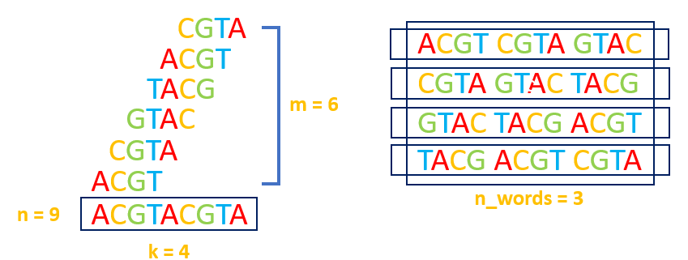
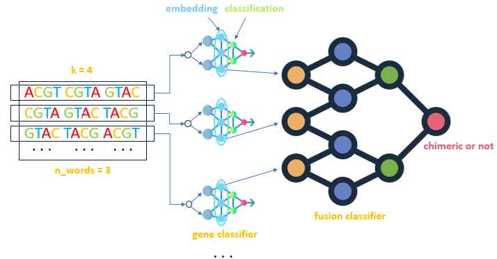

# Inside Gene Fusion

The proposed tool enables the analysis of DNA sequences using three alignment-free techniques, combining text-based and *Graph Learning* approaches in one tool. 
We conducted an in-depth exploration, from an ML perspective, of the problem of recognizing hidden patterns 
that allow us to identify *chimeric RNAs* deriving from oncogenic *gene fusions*.  We approach gene fusion as the chromosomal rearrangement that joins two genes into a single *fusion gene*, 
resulting in a *chimeric* transcript composed of two parts, each originating from one of the fused genes. 
We propose three distinct ML-based methods, each one based on a specific representation technique for the RNA-Seq 
reads: *sentence-based*, *graph-based*, and *hypergraph-based*. 
The *sentence-based* method leverages techniques from NLP, treating the nucleotide sequences as textual data, 
to extract semantic patterns from the reads. The *graph-based* approach advances this by employing De Bruijn graphs 
and *Graph Neural Networks* (GNNs) to capture complex topological relationships. Finally, the *hypergraph-based* 
approach introduces the use of *Hypergraph Neural Networks* (HGNNs), allowing us to model higher-order interactions by 
constructing *hyperedges* from maximal cliques in the De Bruijn graph. 
Through these progressively more sophisticated representations, we show that deeper models are better equipped to uncover 
hidden patterns critical for detecting chimeric reads. As the representational depth increases, so does the capacity to 
capture the underlying structure of the genomic data. However, this improvement comes with the need for more advanced and 
computationally demanding ML models, to handle the complexity of graph-based data.

## Requirements 
### Ubuntu
In order to use the proposed tools, the requiremenets are needed, for techinical reasons **Ubuntu** environment is advised.
```bash
pip install -r requirements.txt
```
It's necessary the gt-shredder from genome tool

```bash
apt install genometools
```

### Conda
The project is tested on a Conda Enviroment with the needed requirements.

```bash
conda create --name <env_name> --file requirements.txt
```

### Important notes
Is preferible to run the scripts from Inside-Gene-Fusion folder.
Take care to change the paths and the name of the dataset inside the scripts to match the personalized experiments.

## Download Gene Trascripts
Into the data folder, there is the file ```download_transcript.py``` needed to dowload the gene transcript inside the file ```genes_panel.txt``` 
After the processing of the genes, into the folder ```transcripts``` is possible to find the fastq files of the trancripts for each gene.

```bash
cd source/gene_fusion_kmer-main/data
python3 download_transcripts.py
```

## 1. Sentence-Based Tool
### Overview
This approach is based on the definition of
a model capable of analyzing and classifying lists of k-mers.
The reads are represented as sets of sentences composed of k-
mers (*sentence-based representation*), to leverage BERT to uncover the hidden
semantic structures within genomic data (see the following Figure). 



Such a sentence-based representation is in turn exploited by
a DL-based model for the detection of chimeric reads, built as
an ensemble of two sub-models: Gene classifier and Fusion
classifier. The goal of Gene classifier is to classify a sentence
into the gene from which it is generated. It is trained using all
the sentences derived from non-chimeric reads extracted from
the transcripts of a reference set of genes (see the following Figure).
To train Fusion classifier, a set of chimeric and non-
chimeric reads is generated from the same reference set of
genes used for training Gene classifier.



### Pre-process the Data for Gene Classification

#### From k-mers to sentences
The k-mers, i.e., all the substrings of length k which can be extracted from a DNA or RNA sequence, allow the local characteristics of
the sequences to be considered while lessening the impact of sequencing errors. In this work we represent a read using the list of its k-mers. This representation
allows the model to learn the local characteristics of reads and perform accurate classification. 

Run the following command to prepare your data for the DNABERT Gene Classifier model:

```bash
python3 source/gene_classifier_pre_process_data_filter.py
```

### Fine-Tune DNABERT for Gene Classification
To fine-tune the pre-trained model DNABERT for Gene Classification run the following command:
```bash
python3 source/dnabert_geneclassifier_fine_tune.py
```
Ensure that you modify the ```n_labels``` variable to match the number of labels in your customized dataset.

### Train Fusion Classifier Model
To identify a DNA sequence as chimeric or not, a Fusion Classifier model is trained on the embedding representation of the sequences given from the fine-tuned gene classifier DNABERT.
To train Fusion classifier, a set of chimeric and non-chimeric reads is generated from the same reference set of genes used for training Gene classifier. Then, for
each read all the sentences of length ```n_words``` are generated and then provided as input to Gene classifier, previously trained. Gene classifier includes an embedding
layer, as well as several classification layers. The outputs of the embedding layer for all the generated sentences are grouped into a single embedding matrix, which
constitutes the input for Fusion classifier. Then, Fusion classifier uses such embedding matrices to distinguish between reads that arise from the fusion of
two genes and reads that originate from a single gene.

Run the followin script to create an embedding dataset for your sequences:
```bash
python3 source/create_embedding_dataset_with_dnabert_geneclassifier.py
```

Now the Fusion Classifier can be trained running the following script:
```bash
python3 source/gene_fusion_dnn.py
```

All the trained model are saved into the source folder

## Graph Based Tool
To overcome the limitations of the sentence-based approach, we employ a more advanced graph-based approach, utilizing De Bruijn graphs.In a De Bruijn graph, nodes represent k-mers, and edges indicate overlaps between consecutive k-mers. By applying GNNs, we are able to capture the complex topological dependencies between nodes through message-passing mechanisms. GNNs allow nodes to aggregate information from neighboring nodes, effectively learning intricate patterns that are essential for accurately identifying fusion events.

To efficiently create De-Bruijn graphs to run the experiments using GNNs the following script has to be run:
```bash
python3 source/pre_process_data_graph_and_hyper.py
```
We proposed a novel approach to efficiently train a GNNs on DNA sequneces.
For each kmerized sequence a De Bruijn graph is created, the informations inside the nodes of the graphs are crucial in order to train a pre-trained DNABERT model on the assumptions that the De Bruijn graphs
represents chimeric or not chimeric sequences.
As the previously approach, a pre-trained DNABERT model is fine-tuned to exctract the embeddings representation of the kmers inside the De Bruijn graph's nodes. This process is crucial to generate informative data for the GNNs model in order to have a more and precisious classifier model.

To train a pre-trained DNABERT model on chimeric or not chimeric sequences run:
```bash
python3 source/dnabert_fusion_fine_tune.py
```
Created the De Bruijn graphs and Fine-Tuned the DNABERT model on chimeric and not chimeric sequences, is possible to train the GNNs model runnign the script:
```bash
python3 source/gene_fusion_graph.py
```

## Hypergraph Based Tool

To further deepen the representational power, we introduce a hypergraph-based approach. Unlike traditional graphs, where edges connect only two nodes, hypergraphs allow for
hyperedges that connect multiple nodes simultaneously, thus capturing multi-way interactions that are commonly observed in biological systems. This higher-order representation
is particularly well-suited for modeling the complex interactions in gene fusion events. By using Hypergraph Neural Networks (HGNNs), which extend the capabilities of GNNs to
hypergraph-structured data, we can extract deeper patterns and relationships, offering a most sophisticated level of analysis for detecting chimeric reads. The methodology followed for this
approach is similar to that used in the graph-based approach, with the difference that in this case, each read is represented with a special hypergraph, which we call De Bruijn H-graph
A crucial aspect of defining a hypergraph is establishing the rule for constructing hyperedges. In our approach, we used the maximal cliques within De Bruijn graphs to generate hyperedges, capturing the structural complexity of reads. In a De Bruijn graph, nodes represent k-mers, and edges indicate overlaps between consecutive k-mers. A clique is a subset of nodes where every
pair is connected, representing complete connectivity. In this context, cliques highlight regions where k-mers overlap across multiple positions, forming continuous subsequences. 

To recognize the cliques into De Bruijn graphs and the cliques, run the script:
```bash
python3 source/gene_fusion_hypergraph.py
```

## Trained Models
The DNABERT fine-tuned models can be retrived to the following link: [Fine Tuned Models](https://drive.google.com/drive/folders/1hfqLJO-TxMcThhgNtDNPQOKnA0zsMJ9L)
It's suggested to move the models inside the source folder to match the paths

## Test
All the dataset and the model are saved at the end of each script, to give the possibity to work with them and develop new scripts, into the test folder is possible to find the script to run the saved models on new ad hoc data
